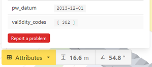

## Help

If you have questions or need help about the data, go to [https://geoforum.nl/](https://geoforum.nl/). When posting questions on the forum, please use the tag `3D BAG`. Although the forum is mainly in Dutch, you are free to use English of course.

## Feedback

We are very happy to hear whatever you have to say about the 3D BAG. You can give your feedback via [this form](https://docs.google.com/forms/d/e/1FAIpQLSe2XLCYNmoFVHrgt_uRXeLLwfzDK7gS2kE7mGH8rnk6ltE0LQ/viewform?).

{ align=left }

If you want to report issues with specific models, you can do so by clicking on the model in the [3D viewer](https://3dbag.nl/en/viewer), and then clicking on the red *Report a problem* button in the Building Information viewer.

## Contact

Finally, you an also contact us directly at <a href="mailto:info@3dbag.nl">info@3dbag.nl</a>.
