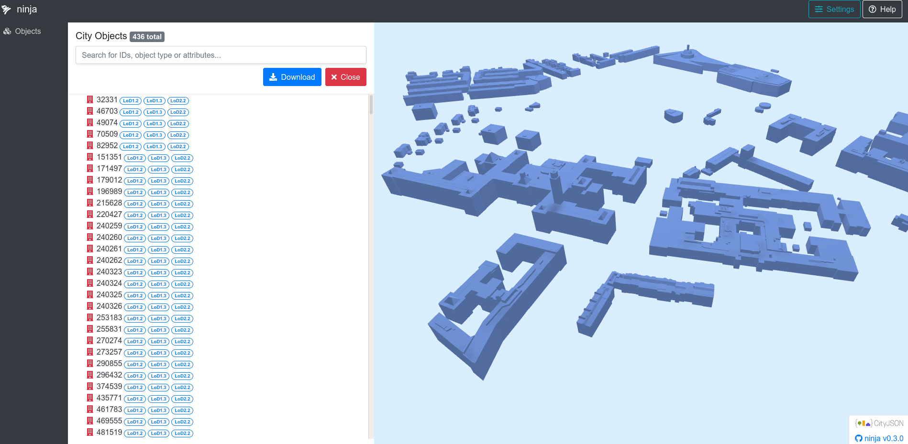
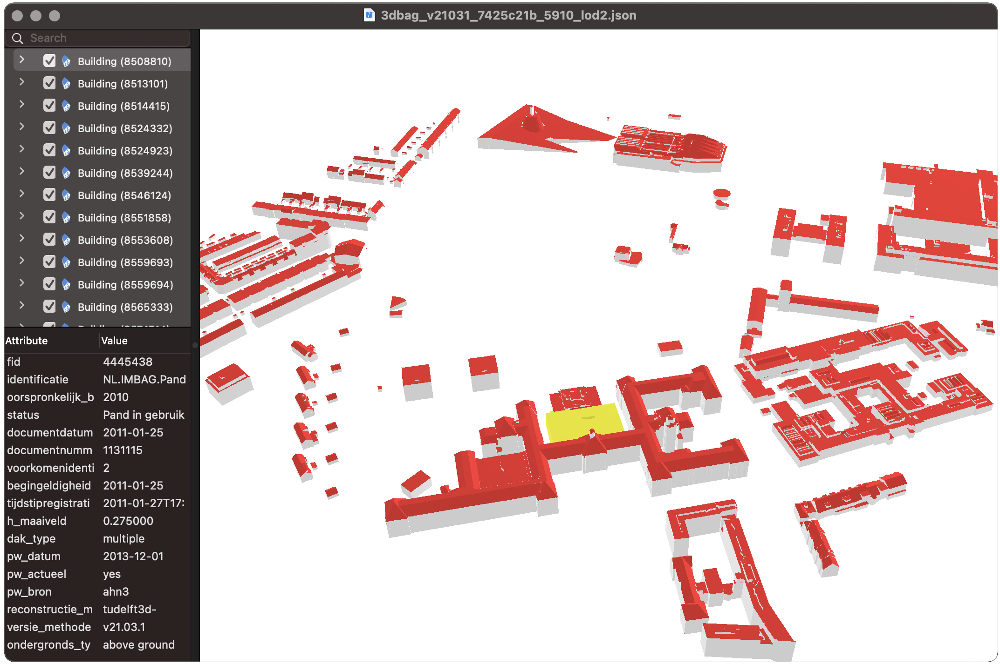
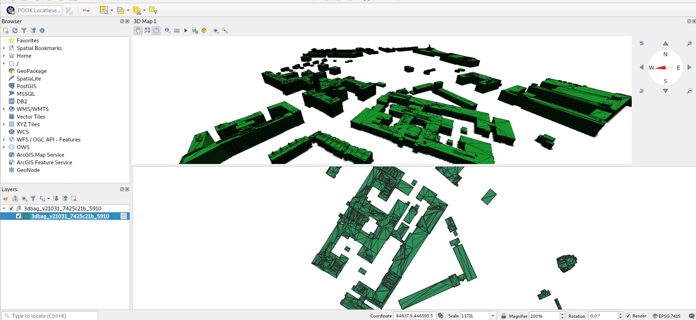

[CityJSON](https://www.cityjson.org/) is an open data format for distributing 3D city models (also known as digital twins), and a JSON-encoding of the [CityGML](https://www.ogc.org/standards/citygml) data model. CityJSON is in the process of becoming a [community standard](https://www.ogc.org/standards/community) of the Open Geospatial Consortium.

The CityJSON specification prescribes how to store the 3D geometry as well as the semantics of common objects in a city, eg. buildings, vegetation, roads, waterways and bridges. This makes the the data model optimal for spatial analysis.

The three guiding principles for the format are compactness, simplicity and ease of use for software development. CityJSON has approximately a 6x smaller size than CityGML due to the JSON-encoding. Furthermore, there are already [several open software that work with CityJSON](https://www.cityjson.org/software/) files. We present a few of them below. Try them out!

The CityJSON files of the 3DBAG contain all the [3D layers](../../schema/layers/#data-layers) (LoD1.2, LoD1.3, LoD2.2), but only the attributes that apply to the whole building.

Note: To download multiple 3DBAG tiles in CityJSON format, please refer to [this script](https://github.com/3DBAG/3dbag-scripts/blob/main/tile_download.py).

## ninja and azul

[ninja](http://ninja.cityjson.org/) is a drag-and-drop web application for visualising and editing CityJSON files.

On macOS [azul](https://github.com/tudelft3d/azul) can visualise several data formats, including CityJSON.

<figure>
  <a href="../../../images_common/ninja.png">
    
  </a>
  <figcaption>A portion of the 3DBAG visualised in ninja.</figcaption>
</figure>

<figure>
  <a href="../../../images_common/azul.png">
    
  </a>
  <figcaption>A portion of the 3DBAG visualised in azul.</figcaption>
</figure>


## QGIS CityJSON Loader plugin

With the [CityJSON loader plugin](https://github.com/cityjson/cityjson-qgis-plugin) it is possible to load CityJSON files into QGIS 3, and view them in 3D. You can open the 3D viewer by selecting `View` -> `New 3D Map View`. For QGIS 3 versions older than 3.2, there is an [extra step necessary](https://github.com/cityjson/cityjson-qgis-plugin#3d-view-in-qgis-30).

<figure>
  <a href="../../../images_common/qgis.png">
    
  </a>
  <figcaption>A portion of the 3DBAG visualised in QGIS, with the 3D Map View on the top and the features in 2D on the bottom.</figcaption>
</figure>

## cjio

[cjio](https://github.com/cityjson/cjio) is tool with a command-line-interface for working with CityJSON files. For instance, you can get information about the file contents, subset and merge files, convert them to other formats etc.

List all the attributes (and more) in a 3DBAG file:

```shell
cjio 3dbag_<version>_<tile ID>.json info --long
```

Extract only the LoD2.2 from a 3DBAG file:

```shell
cjio 3dbag_<version>_<tile ID>.json extract_lod 2 save out.json
```
