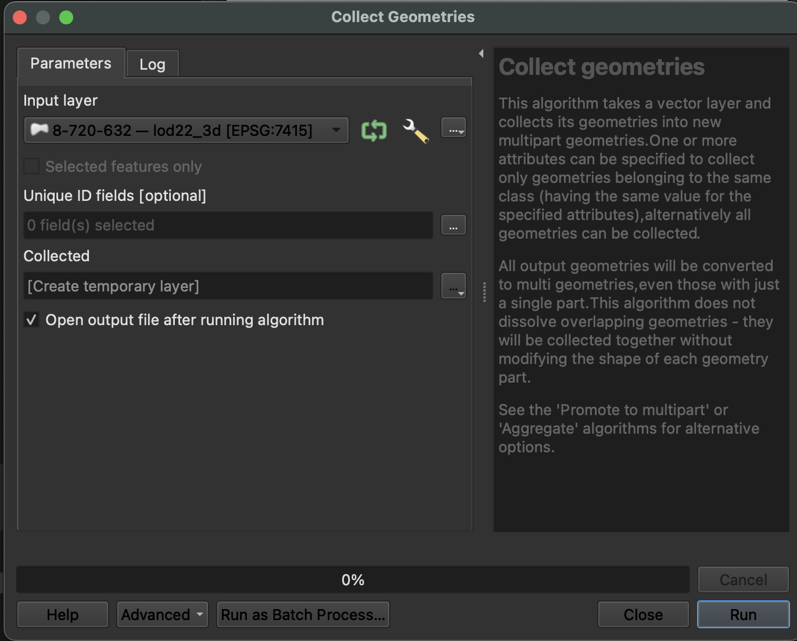
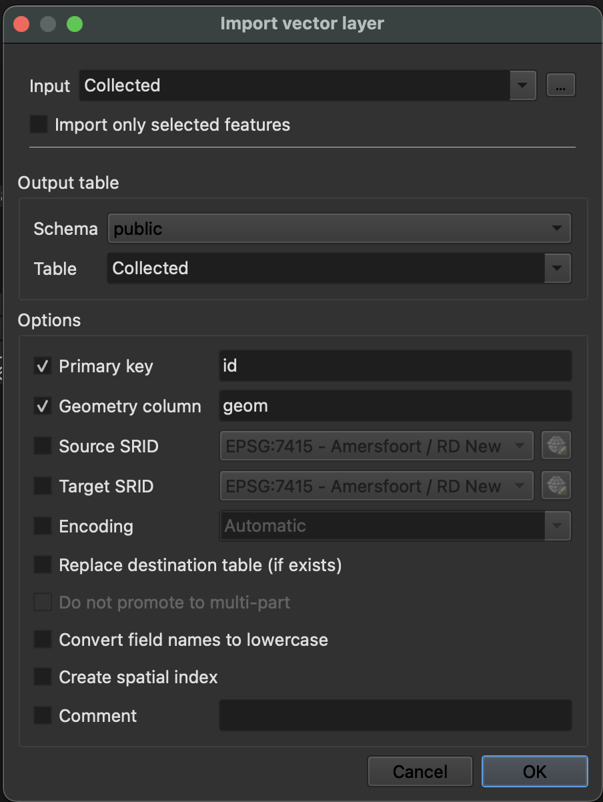

[GeoPackage](https://www.geopackage.org/) is an open geodata format, based on [SQLite](https://www.sqlite.org/index.html). It supports vector features, tile matrix sets, attributes and also extensions. The format can be used for storing certain types of 3D geometry. It is widely adopted an can be used in QGIS, ArcGIS and FME too.

We have 3DBAG GeoPackage files available separately for each tile, and we also offer one big file that contains the entire 3DBAG dataset. The GeoPackage files contain [all the layers](../../schema/layers/#data-layers).

Note: To automatically download multiple 3DBAG tiles in GeoPackage format, please refer to [this script](https://github.com/3DBAG/3dbag-scripts/blob/main/tile_download.py).

### GeoPackage data dump file
When working with the compressed GeoPackage files, it is not strictly necessary to decompress them.
GDAL supports [virtual file systems](https://gdal.org/user/virtual_file_systems.html#vsizip-zip-archives), which allows to access the contents of the compressed .gpkg without decompressing the file first.
The GeoPackage that contains the entire 3DBAG (the data dump file) has been compressed as a [Seek-Optimized ZIP (SOZip)](https://gdal.org/user/virtual_file_systems.html#sozip-seek-optimized-zip) file.
[GDAL (from version 3.7)](https://gdal.org/user/virtual_file_systems.html#sozip-seek-optimized-zip) supports the seek-optimized profile for .zip files, giving an improved performance.

An example GDAL command for accessing the uncompressed Netherlands GeoPackage:

`ogrinfo -so -al /vsizip/nl_3dbag.gpkg.zip`

The compressed GeoPackage files can be imported directly to a PostgreSQL database using [GDAL](https://gdal.org) and more specifically the [ogr2ogr](https://gdal.org/programs/ogr2ogr.html) tool. Here is an example:

`PG_USE_COPY=YES OGR_TRUNCATE=YES ogr2ogr -gt 65536 -lco SPATIAL_INDEX=NONE -f PostgreSQL PG:"dbname=<DATABASE> port=<PORT> host=<HOST> user=<USER> active_schema=<SCHEMA> password=<PASSWORD>" "/vsizip/3dbag_nl.gpkg.zip"`

## GeoPackage in 3D in QGIS

When opening a 3DBAG file in QGIS (by dragging the file or going to `Layer` -> `Add Layer` -> `Add Vector Layer...`), you can choose which layers to import. In QGIS 3 it is possible to view the 3D layers in the 3D viewer (exact steps may vary between versions):

1. Adjust the `Layer Properties`. Go to the `3D View` tab and change `No Symbols` to `Single Symbol` and adjust the settings to your preference. In older QGIS 3 versions you will find the button `Enable 3D renderer` instead.

2. Go to `View` -> `3D Map View` to open the 3D viewer.

<figure>
  
  <figcaption>The tab in the Layer Properties with the settings for the 3D Map View.</figcaption>
</figure>

<figure>
  
  <figcaption>A portion of the 3DBAG data in GeoPackage format. On the top is the 3D Map View, in the left the attributes, and in the bottom the 2D features.</figcaption>
</figure>

## Import from QGIS to Postgres
To import your 3DBAG `.gpkg` file from QGIS into your PostgreSQL database, you may need to convert the geometry column type to ensure compatibility. Follow these steps:

#### 1) Convert Geometry Type:

Use the `Collect Geometries` tool to standardize the geometry type.
Go to `Vector` → `Geometry Tools` → `Collect Geometries`.
Select your layer and create a temporary output layer.

 <figure>
  
  <figcaption>Changing the geometry column type in QGIS.</figcaption>
</figure>

#### 2) Import the Layer to PostgreSQL

1) Open `Database`-->`DB Manager`
2) Expand `PostGIS` and connect to your database.
3) Click the `Import Layer/File` button and
4) Select the temporary layer as the input.
5) Fill in the required details (table name, schema, etc.)

 <figure>
  
  <figcaption>How to import layer from QGIS to your DB.</figcaption>
</figure>
