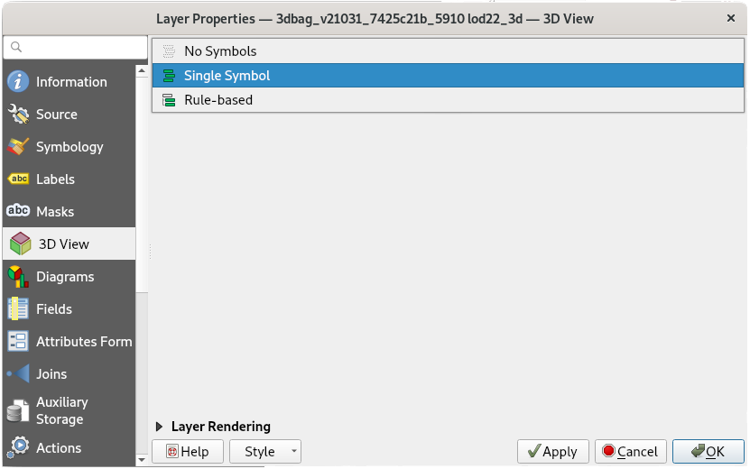
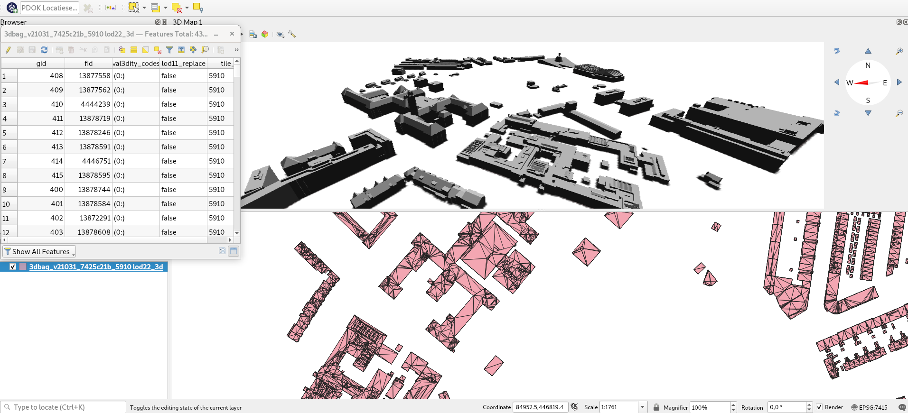

[GeoPackage](https://www.geopackage.org/) is an open geodata format, based on [SQLite](https://www.sqlite.org/index.html). It supports vector features, tile matrix sets, attributes and also extensions. The format can be used for storing certain types of 3D geometry. It is widely adopted an can be used in QGIS, ArcGIS and FME too.

We have 3D BAG GeoPackage files available separately for each tile, and we also offer one big file that contains the entire 3D BAG dataset. The GeoPackage files contain [all the layers](../../schema/layers/#data-layers).

## GeoPackage in 3D in QGIS

When opening a 3D BAG file in QGIS (by dragging the file or going to `Layer` -> `Add Layer` -> `Add Vector Layer...`), you can choose which layers to import. In QGIS 3 it is possible to view the 3D layers in the 3D viewer (exact steps may vary between versions):

1. Adjust the `Layer Properties`. Go to the `3D View` tab and change `No Symbols` to `Single Symbol` and adjust the settings to your preference. In older QGIS 3 versions you will find the button `Enable 3D renderer` instead.

2. Go to `View` -> `3D Map View` to open the 3D viewer.

<figure>
  
  <figcaption>The tab in the Layer Properties with the settings for the 3D Map View.</figcaption>
</figure>

<figure>
  
  <figcaption>A portion of the 3D BAG data in GeoPackage format. On the top is the 3D Map View, in the left the attributes, and in the bottom the 2D features.</figcaption>
</figure>
