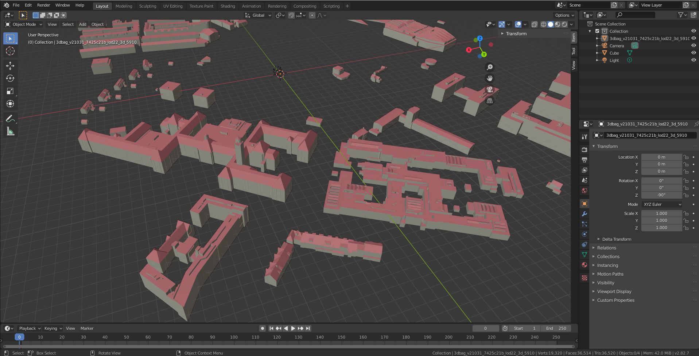
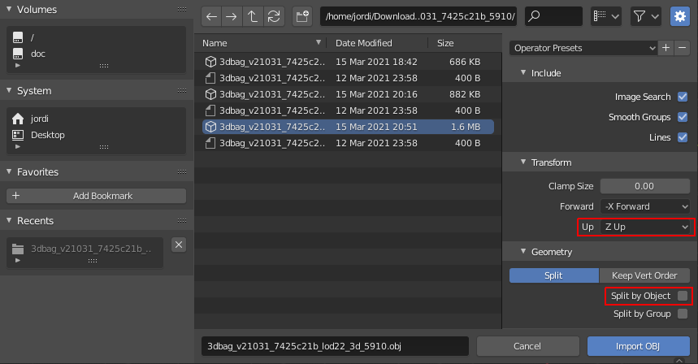
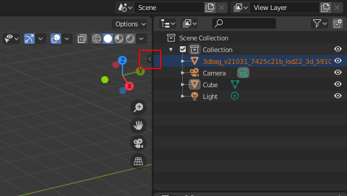
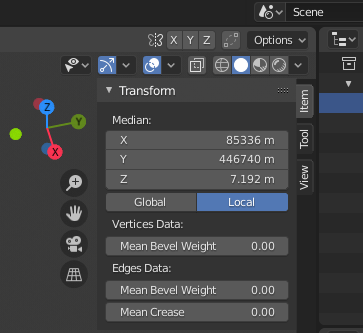

[Wavefront OBJ](http://paulbourke.net/dataformats/obj/) is an open data format for 3D graphics. It does not contain any attributes or semantics, only the 3D geometry of the building models. This format is primarily suitable for importing the 3DBAG geometries into 3D graphics applications or 3D CAD applicatons (this might require additional format conversion).

The OBJ files for the 3DBAG contain the 3D geometries only and [each 3D layer](../schema/layers.md#data-layers) is stored in a separate file. The three OBJ files are compressed into a single ZIP file per tile. The object coordinates are in the [Amersfoort / RD New + NAP height](http://epsg.io/7415) coordinate reference system.

Note: To automatically download multiple 3DBAG tiles in OBJ format, please refer to [this script](https://github.com/3DBAG/3dbag-scripts/blob/main/tile_download.py).

## Blender

<figure>
  
  <figcaption>A portion of the 3DBAG data opened in Blender.</figcaption>
</figure>

OBJ files can be directly opened in Blender. Besides, there is also a [plugin for importing CityJSON files](https://github.com/cityjson/Up3date) into Blender.

The objects in the files are a real-world coordinate system. Therefore they have very large coordinates. When the file is imported into Blender, they are not centered around the origin (0, 0, 0) which causes the surfaces to flicker. Therefore, it is recommended to move the objects to the origin.

<figure>
  
</figure>

When importing the OBJ file, choose the option `Z Up`, so that the objects are correctly oriented. If you turn off the `Split by Object`, then all objects (the buildings) are imported as a single Blender object, which makes it easier to move the whole file content. After the import, you can focus the camera to the objects by selecting `Scene Collection` on the right of the screen, then pressing `.` on the numpad (the regular `.` on the keyboard does not work).

<figure>
  
</figure>

Then select the object (or all individual objects if split them on import) and press `Tab` to open the *Edit Mode*. Then click on the small arrow that is marked in the screenshot above.

<figure>
  
</figure>

Then change the X and Y values to `0`. Press `.` on the numpad again to re-focus the camera on the model.
