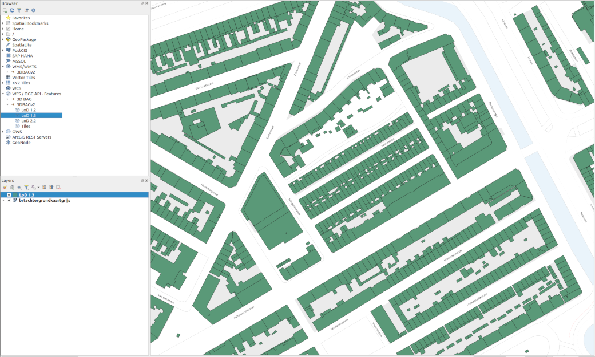

Webservices make it possible to specify via a URL exactly which models to download from the 3DBAG. We offer traditional 2D webservices (WFS and WMS) and a 3D webservice that we call the 3DBAG API.

The 2D webservices are supported by all major GIS software packages. They serve directly the [2D layers](../schema/layers.md#data-layers) of the 3DBAG and a tile-index that corresponds to the 3DBAG tiles that are available for download in various formats. 

Additionally, the 3D API can be used to retrieve 3DBAG buildings with their 3D geometry and all the available attributes in the [CityJSONFeatures](https://www.cityjson.org/specs/2.0.0/#text-sequences-and-streaming-with-cityjsonfeature) format.

You can find the webservice links on the 3DBAG [Downloads](https://3dbag.nl/en/download) page.


## 2D webservices

### WFS (2D)

The [Web Feature Service](https://www.ogc.org/standards/wfs) (WFS) is an Open Geospatial Consortium standard, and it describes how to query, create and modify geospatial data through the internet.

Available layers:

- lod12
- lod13
- lod22
- tiles

<figure>
  <a href="../../../images_common/wfs.png">
    
  </a>
  <figcaption>LoD1.3 2D WFS layer visualised in QGIS, with the BRT Baselayer from PDOK in the background.</figcaption>
</figure>

In order to properly filter the WFS layer in python, please take a look at[our script](https://github.com/3DBAG/3dbag-scripts/blob/main/wfs_filtering.py).

### WMS (2D)

The [Web Map Service](https://www.ogc.org/standards/wms) is an Open Geospatial Consortium standard to retrieve maps as images through the internet.

<figure>
  <a href="../../../images_common/wms.png">
    
  </a>
  <figcaption>LoD1.3 2D WMS layer visualised in QGIS, with the BRT Baselayer from PDOK in the background.</figcaption>
</figure>

### 2D webservices in QGIS

[Here](https://www.youtube.com/watch?v=dWTGOm3Emw4&list=PL4POqt8zsiXFJEEF88f6uAnfuOQSAoG6l) you find a tutorial on using webservices in QGIS, created by one of our colleagues of the 3D geoinformation research group. At `3:18` in the video you can see how to load the webservices of the previous 3DBAG version. The process is almost the same for the current 3DBAG version.

The video also refers to the [PDOK services plugin](https://plugins.qgis.org/plugins/pdokservicesplugin/), which is very handy for loading base layers.


## 3DBAG API (3D)

The base URL of the 3DBAG API is [api.3dbag.nl](https://api.3dbag.nl) and more information about the available endpoints can be found on its [embedded documentation page](https://api.3dbag.nl/api.html). As opposed to the 2D webservices described above, the 3DBAG API returns 3D geometries. It can be used to retrieve [a single building](https://api.3dbag.nl/collections/pand/items/NL.IMBAG.Pand.1655100000500568) (using the BAG `identificatie` code) or [all buildings within a certain bounding box](https://api.3dbag.nl//collections/pand/items?bbox=75900.011,447000.034,76000.011,447200.034) with all the available attributes in [CityJSONFeature objects](https://www.cityjson.org/specs/2.0.0/#text-sequences-and-streaming-with-cityjsonfeature).  

 The 3D API returns a sequence of CityJSONFeature objects which can be saved in a [CityJSONSeq](https://www.cityjson.org/cityjsonseq/) file with the `city.jsonl` extension, using the Python snippet below:

```python
import urllib.request
import json

myurl = "https://api.3dbag.nl/collections/pand/items/NL.IMBAG.Pand.1655100000500568"
with urllib.request.urlopen(myurl) as response:

    j = json.loads(response.read().decode('utf-8'))
    with open("output.city.jsonl", "w") as my_file:
        my_file.write(json.dumps(j["metadata"]) + "\n")
        if "feature" in j:
            my_file.write(json.dumps(j["feature"]) + "\n")
        if "features" in j:
            for f in j["features"]:
                my_file.write(json.dumps(f) + "\n")
```

If you need your data in CityJSON format, you can convert from CityJSONSeq to CityJSON, using the tool [cjio](https://github.com/cityjson/cjio) as follows:

```bash
cat <path-to>output.city.jsonl | cjio stdin save <path-to>output.city.json
```

Note: For requests that return more than 10 buildings, the 3DBAG API paginates the results. We recommend using [our script to convert paginated responses into a single CityJSON file](https://github.com/3DBAG/3dbag-scripts/blob/main/api_to_cityjson.py).

The 3DBAG API is currently not OGC-compliant, but we aim for full compliance with the [OGC API Features specification](https://ogcapi.ogc.org/features/) in a later release. At the moment the only supported CRS is Amersfoort / RD New + NAP height (EPSG:7415).

## 3D Tiles

[3D Tiles](https://www.ogc.org/standards/3dtiles/) is an Open Geospatial Consortium community standard for streaming massive heterogeneous 3D geospatial datasets.
We use 3D Tiles for streaming the building models into our 3D Viewer and we make the same set of 3D Tiles available for external use too.

The three LoD-s (LoD1.2, LoD1.3, LoD2.2) are served as separate tilesets. 
The link to the tilesets can be found on our [Downloads page](https://3dbag.nl/en/download).

The volume of usage is not limited, but this may change in the future.
The [Copyright notice](https://docs.3dbag.nl/en/copyright/) is required.

Details of the 3D Tiles:

- Uses [3D Tiles v1.1](https://docs.ogc.org/cs/22-025r4/22-025r4.html).
- Tileset and content CRS is EPSG:4978.
- The tileset content is binary glTF (.glb).
- The glTF assets contain feature metadata (per Building), using the [EXT_mesh_features](https://github.com/CesiumGS/glTF/tree/3d-tiles-next/extensions/2.0/Vendor/EXT_mesh_features) and [EXT_structural_metadata](https://github.com/CesiumGS/glTF/tree/3d-tiles-next/extensions/2.0/Vendor/EXT_structural_metadata) extensions.
- The buildings are colored to a uniform color.
- The glTF files are compressed, using the [KHR_mesh_quantization](https://github.com/KhronosGroup/glTF/tree/main/extensions/2.0/Khronos/KHR_mesh_quantization) and [EXT_meshopt_compression](https://github.com/KhronosGroup/glTF/tree/main/extensions/2.0/Vendor/EXT_meshopt_compression) extensions.
- The main tileset is using explicit tiling and it is split into several [External tilesets](https://docs.ogc.org/cs/22-025r4/22-025r4.html#core-external-tilesets).

3D Tiles were produced with [Tyler](https://github.com/3DGI/tyler).

Below is a sample script to include the 3DBAG 3D Tiles in a Cesium viewer.
Note that you need to substitute `<YOUR CESIUM ION TOKEN>` with your Cesium Ion access token.

```html
<!DOCTYPE html>

<html lang="en">

<head>

  <meta charset="utf-8">

  <!-- Include the CesiumJS JavaScript and CSS files -->
  <script src="https://cesium.com/downloads/cesiumjs/releases/1.133/Build/Cesium/Cesium.js"></script>
  <link href="https://cesium.com/downloads/cesiumjs/releases/1.133/Build/Cesium/Widgets/widgets.css"
        rel="stylesheet">

</head>

<body>

<div id="cesiumContainer"></div>

<script type="module">
    // Your access token can be found at: https://ion.cesium.com/tokens.
    // Replace `your_access_token` with your Cesium ion access token.
    Cesium.Ion.defaultAccessToken = '<YOUR CESIUM ION TOKEN>';

    // Initialize the Cesium Viewer in the HTML element with the `cesiumContainer` ID.
    const viewer = new Cesium.Viewer('cesiumContainer', {
        terrain: Cesium.Terrain.fromWorldTerrain(),
    });


    try {
        const tileset = await Cesium.Cesium3DTileset.fromUrl(
            'https://data.3dbag.nl/v20250903/cesium3dtiles/lod22/tileset.json'
        );
        viewer.scene.primitives.add(tileset)
        viewer.zoomTo(
            tileset,
            new Cesium.HeadingPitchRange(
                0.5,
                -0.5,
                tileset.boundingSphere.radius * 0.05
            )
        );
    } catch (error) {
        // Handle errors
        console.log(`There was an error while creating the 3D tileset. ${error}`);
    }

</script>

</div>

</body>

</html>
```
