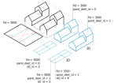

# Data Layers

{ width=100% }

The diagram above shows the relation between a building in the real world and how is it modeled in the 3D BAG.
The BAG models buildings with their largest extent as viewed from above. In practice this means a single 2D polygon per building, as it is displayed by the black polygon in the figure. Therefore, the **BAG polygon** also includes parts of the building that are below terrain level.

In order to create an accurate model of the **above terrain** parts of a building, we cut off the **below terrain** parts from the BAG polygon. We only consider the parts above the terrain, because we do not have data on the 3D extent of the parts below the terrain.

From the parts above terrain we then generate the 3D models in LoD1.2, 1.3 and 2.2. We realise that for some applications it is more suitable to read 2D polygons, and the building height information from attributes. Therefore, we also provide a 2D counterpart in each LoD.

!!! note "lod11_replace"
    In case of greenhouses and large warehouses we do not cut off any parts of the BAG model, but take the polygon as is, and only generate an LoD1.1 model. Thus, such buildings only have an LoD1.1 model and are marked with the attribute value `lod11_replace = true`.

In case of the 2D models, the polygons represent the 2D projection of the roof planes of the 3D model. For LoD1.2 and LoD1.3 the 3D model can be fully reconstructed from the 2D model, by taking the 2D polygons and extruding each to one of their [`h_dak_*`](attributes.md#h_dak_50p) height values. However, this is not true for the LoD2.2 models, since here we have slanted roof planes, which cannot be represented by a 2D polygon and a single height value.

The 3D BAG has 6 geometric representations of a BAG object (a *feature*). The 6 representations are the 2D and 3D variants of the LoD1.2, LoD1.3 and LoD2.2 models of the feature. Therefore, the BAG models, which are stored on the `pand` layer, have a *feature ID* ([`fid`](attributes.md#fid)), while their geometric representations have *geometry IDs* ([`gid`](attributes.md#gid)). Depending on the representation, a single feature can have multiple geometry parts.

Some buildings have multiple disjoint part above the terrain, while they are connected with an underground garage for instance. In such cases, the above terrain parts are split into separate models with the same `fid`, and the [`pand_deel_id`](attributes.md#pand_deel_id) can identify these parts within the same feature.

The figure below illustrates the relation between the **feature** and the various geometry parts **above terrain**.

{ width=100% }

<!-- start layers (DO NOT REMOVE THIS MARKER AND DO NOT EDIT THE TEXT BELOW. SEE README.) -->
## `pand`

Stores the attributes and geometry of the `Pand` object of the BAG, plus the attributes of the 3D BAG that relate to the whole building. Contains only those buildings that went into the reconstruction. The attribute [`fid`](attributes.md#fid) is the unique, numeric ID of the objects. Besides being the primary key, `fid` is also used for joining the other layers to `pand`.

## `lod12_3d`

A 3D model of the building parts above the terrain, modelled in LoD1.2. Can join to `pand` on `fid`.

## `lod12_2d`

The 2D projection of the LoD1.2 model. The elevation of the detected LoD1.2 roof planes are stored as height attributes ([`h_dak_*`](attributes.md#h_dak_50p)). Only the above terrain parts of the BAG footprint are included. Can join to `pand` on `fid`.

## `lod13_3d`

A 3D model of the building parts above the terrain, modelled in LoD1.3. Can join to `pand` on `fid`.

## `lod13_2d`

The 2D projection of the LoD1.3 model. The elevation of the detected LoD1.3 roof planes are stored as height attributes ([`h_dak_*`](attributes.md#h_dak_50p)). Only the above terrain parts of the BAG footprint are included. Can join to `pand` on `fid`.

## `lod22_3d`

A 3D model of the building parts above the terrain, modelled in LoD2.2. Can join to `pand` on `fid`.

## `lod22_2d`

The 2D projection of the LoD2.2 model. The elevation of the detected LoD2.2 roof planes are stored as height attributes ([`h_dak_*`](attributes.md#h_dak_50p)). Note that the slanted roof planes of the 3D model cannot be reconstructed from these 2D polygons and height attributes. Only the above terrain parts of the BAG footprint are included. Can join to `pand` on `fid`.

<!-- end layers (DO NOT REMOVE THIS MARKER) -->
