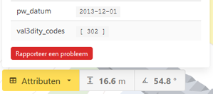

## Hulp

Als je vragen hebt over de data of hulp nodig hebt, kun je [https://geoforum.nl/](https://geoforum.nl/) bezoeken. Gelieve de tag `3D BAG` te gebruiken bij het posten van vragen op het forum.

## Feedback

We horen graag wat je dan ook te vertellen hebt over de 3D BAG. Je kunt ons feedback geven via [dit formulier](https://forms.gle/N1FPRp3RG45EaBjUA). De vragen zijn in het Engels, maar je kunt ook antwoorden in het Nederlands.

{ align=left }

Mocht je problemen met specifieke modellen willen rapporteren, kun je dat doen door op het model te klikken in de [3D viewer](https://3dbag.nl/en/viewer) en vervolgens op de rode *Rapporteer een probleem* knop te drukken in de pop-up.

## Contact

Voor overige opmerkingen kun je ons ook direct bereiken op <a href="mailto:info@3dbag.nl">info@3dbag.nl</a>.
