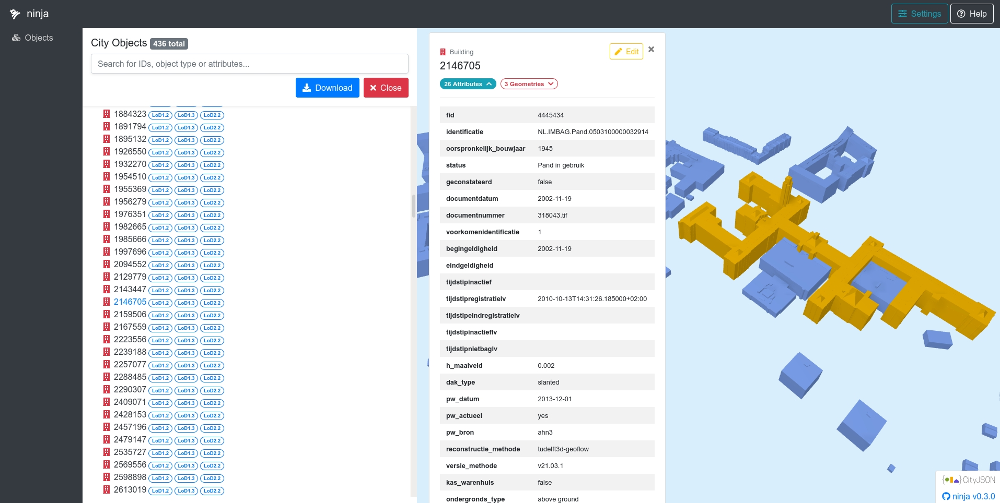

<a href=https://www.cityjson.org/>CityJSON</a> is een open bestandsformaat voor 3D stadsmodellen (ook wel digital twins genoemd) en een JSON-codering van het datamodel van CityGML. De standaard zit in het proces om een <a href=https://www.ogc.org/standards/community>community standard</a> te worden van het Open Geospatial Consortium (OGC).

De specificaties van CityJSON beschrijven de manier van het opslaan van zowel de geometrie als semantiek van veelvoorkomende 3D objecten, waaronder gebouwen, vegetatie, wegen, waterlichamen en bruggen. Dit maakt het geschikt voor 3D geografische analyse.

Het is ontwikkeld om compact en makkelijk te gebruiken door ontwikkelaars te zijn. CityJSON is gemiddeld 6 maal zo compact als CityGML door de JSON-codering. Daarnaast zijn er door het gemakkelijke formaat al <a href=https://www.cityjson.org/software/>verscheidene tools</a> ontwikkeld voor het verwerken, bewerken en visualiseren van CityJSON-bestanden. Een aantal van die tools is hieronder uitgelicht, probeer het uit!

### ninja en azul

<a href=http://ninja.cityjson.org/>ninja</a> is een webapplicatie voor het visualiseren én bewerken van CityJSON-bestanden.

Voor macOS is er <a href=https://github.com/tudelft3d/azul>azul</a>, een 3D viewer voor verscheidene formaten waaronder CityJSON.

*Een 3D BAG tegel gevisualiseerd met ninja*

### QGIS CityJSON Loader plugin

De <a href=https://github.com/cityjson/cityjson-qgis-plugin>CityJSON Loader plugin</a> voor QGIS 3 maakt het mogelijk om CityJSON-bestanden in te laden in QGIS, inclusief 3D visualisering. Je kan de 3D visualisatie openen door naar `View` -> `New 3D Map View` te gaan. Voor versies van QGIS 3 ouder dan 3.2 is er daarvoor echter <a href=https://github.com/cityjson/cityjson-qgis-plugin#3d-view-in-qgis-30>een extra stap vereist</a>.

*Een 3D BAG tegel geopend in QGIS, met de 3D Map View links en de attributen rechts*

### cjio

<a href=https://github.com/cityjson/cjio>cjio</a> is een command-line-interface voor het verwerken van CityJSON-bestanden. Je kan er bijvoorbeeld data mee valideren, een bestand opdelen (subsets maken) en bestanden samenvoegen.