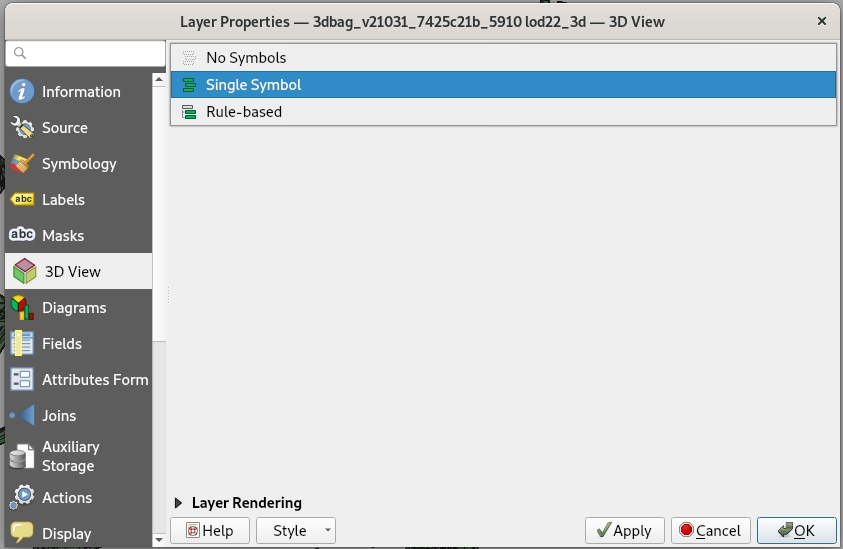
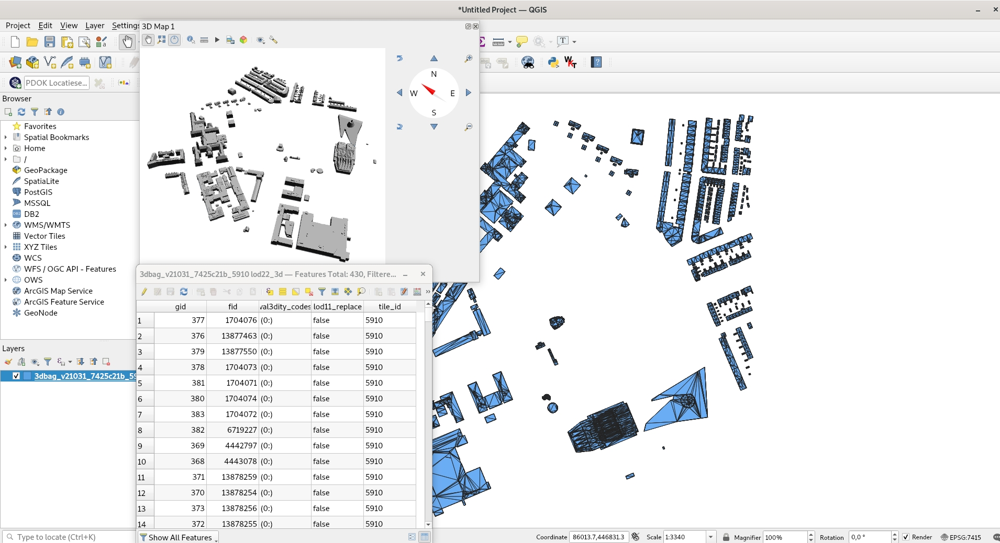

<a href=https://www.geopackage.org/>GeoPackage</a> is een open bestandsformaat dat conventies beschrijft hoe data opgeslagen kunnen worden in een <a href=https://www.sqlite.org/index.html>SQLite</a> database. Het ondersteunt vector features, tile matrix sets, attributen en er is ruimte voor extensies. Het formaat ondersteunt 3D-geometrieën, en kan geopend worden met bijvoorbeeld QGIS, ArcGIS of FME.

### GeoPackage in 3D in QGIS

Wanneer je de data in QGIS importeert (door het bestand te slepen of te gaan naar `Layer` -> `Add Layer` -> `Add Vector Layer...`) kan je kiezen uit de verschillende lagen die het bestand bevat. Om de data in 3D te zien (vanaf QGIS 3.0, maar afhankelijk van de exacte versie):

- Pas eerst de`Layer Properties` aan. Ga daar naar de `3D View` tab, verander `No Symbols` naar `Single Symbol` en pas de verandering toe.
- Of: in oudere versies van QGIS 3 moet in plaats daarvan op dezelfde plek het knopje `Enable 3D renderer` aan worden gezet. 

- Ga vervolgens naar `View` -> `3D Map View` om de data te bekijken.

*De tab in de Layer Properties waar de instellingen aangepast kunnen worden voor de 3D Map View*

*Een tegel in GeoPackage-formaat in QGIS. Bovenaan de 3D Map View, onderaan de attributen, en op de achtergrond de features in 2D.*