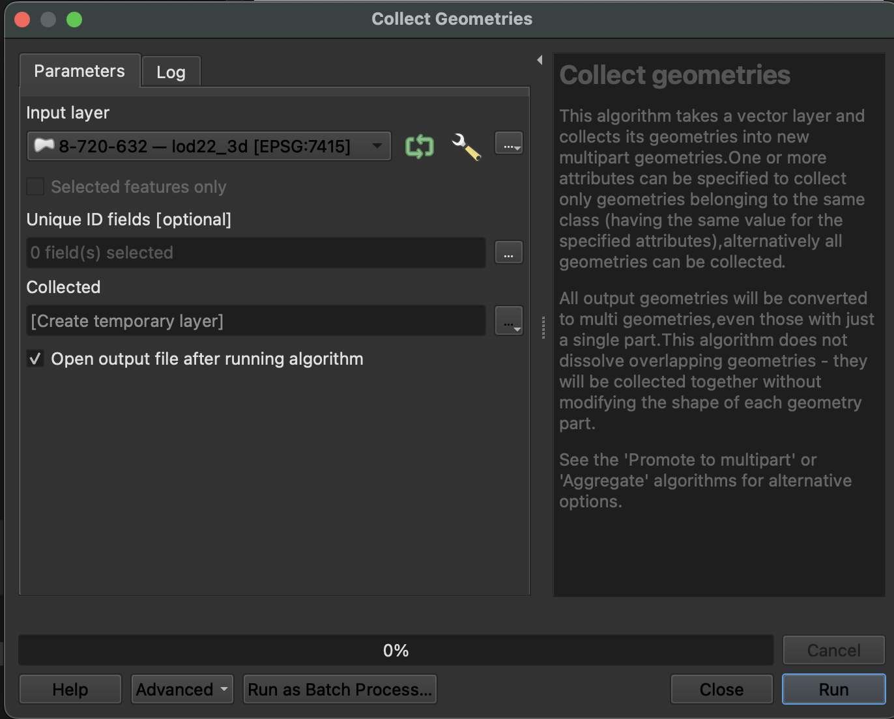
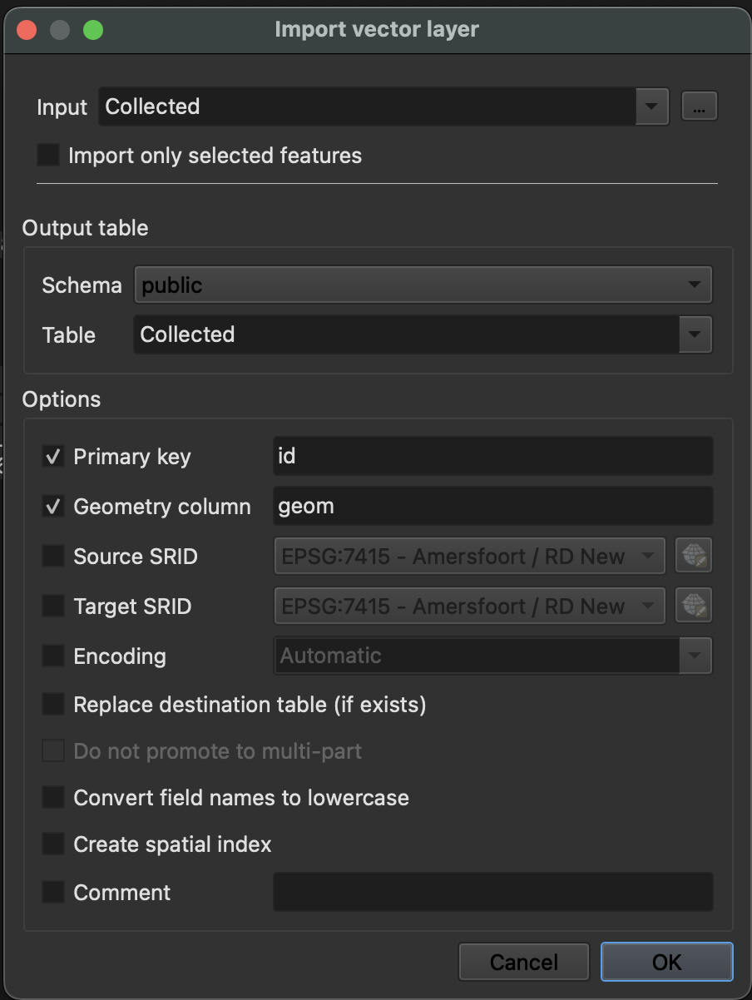

[GeoPackage](https://www.geopackage.org) is een open bestandsformaat dat conventies beschrijft hoe data opgeslagen kunnen worden in een [SQLite](https://www.sqlite.org/index.html) database. Het ondersteunt vector features, tile matrix sets, attributen en er is ruimte voor extensies. Het formaat ondersteunt 3D-geometrieën, en kan geopend worden met bijvoorbeeld QGIS, ArcGIS of FME.

Wie bieden een apart 3DBAG GeoPackage-bestand aan voor iedere tegel. En daarnaast is er een groot GeoPackage bestand beschikbaar waar de complete 3DBAG in zie. Alle GeoPackage bestanden bevatten [alle lagen](../../schema/layers/#data-layers).

NB: Om geautomatiseerd meerdere 3DBAG-tiles in GeoPackage-formaat te downloaden, kun je [dit script](https://github.com/3DBAG/3dbag-scripts/blob/main/tile_download.py) gebruiken.

### GeoPackage data dump bestand
Bij het werken met gecomprimeerde GeoPackage bestanden is het niet strikt noodzakelijk om ze uit te pakken.
GDAL ondersteunt [virtuele bestandssystemen](https://gdal.org/user/virtual_file_systems.html#vsizip-zip-archives), waardoor de inhoud van de gecomprimeerde .gpkg kan worden benaderd zonder het bestand eerst uit te pakken.
Het GeoPackage dat de volledige 3DBAG bevat (het data dump bestand) is gecomprimeerd als een [Seek-Optimized ZIP (SOZip)](https://gdal.org/user/virtual_file_systems.html#sozip-seek-optimized-zip) bestand.
[GDAL (vanaf versie 3.7)](https://gdal.org/user/virtual_file_systems.html#sozip-seek-optimized-zip) ondersteunt het seek-optimized profiel voor .zip-bestanden, wat een verbeterde prestatie oplevert.

Een voorbeeld GDAL-commando voor toegang tot het ongecomprimeerde Nederlandse GeoPackage:

`ogrinfo -so -al /vsizip/nl_3dbag.gpkg.zip`

## GeoPackage in 3D in QGIS

Wanneer je de data in QGIS importeert (door het bestand er naar toe te slepen of te gaan naar `Layer` -> `Add Layer` -> `Add Vector Layer...`) kun je kiezen uit de verschillende lagen die het bestand bevat. Om de data in 3D te zien (vanaf QGIS 3.0, maar afhankelijk van de exacte versie):

- Pas eerst de`Layer Properties` aan. Ga daar naar de `3D View` tab, verander `No Symbols` naar `Single Symbol` en pas de verandering toe.
- Of: in oudere versies van QGIS 3 moet in plaats daarvan op dezelfde plek het knopje `Enable 3D renderer` aan worden gezet.

- Ga vervolgens naar `View` -> `3D Map View` om de data te bekijken.

<figure>
  
  <figcaption>De tab in de Layer Properties waar de instellingen aangepast kunnen worden voor de 3D Map View.</figcaption>
</figure>

<figure>
  
  <figcaption>Een tegel in GeoPackage-formaat in QGIS. Bovenaan de 3D Map View, links de attributen, en onderaan de features in 2D.</figcaption>
</figure>

## Importeren van QGIS naar Postgres

Om je 3DBAG `.gpkg`-bestand vanuit QGIS in je PostgreSQL-database te importeren, moet je mogelijk het type van de geometriekolom aanpassen voor compatibiliteit. Volg deze stappen:

1. **Geometrietype converteren (indien nodig):**
   - Gebruik de tool `Geometrieën verzamelen` om het geometrietype te standaardiseren.
   - Ga naar `Vector` → `Geometrietools` → `Geometrieën verzamelen`.
   - Selecteer je laag en maak een tijdelijke uitvoerlaag aan.

   <figure>
     
     <figcaption>Het type van de geometriekolom aanpassen in QGIS.</figcaption>
   </figure>

2. **Laag importeren naar PostgreSQL:**
   - Open `Database` → `DB Manager`.
   - Vouw `PostGIS` uit en maak verbinding met je database.
   - Klik op de knop **Laag/bestand importeren**.
   - Selecteer de tijdelijke laag als invoer.
   - Vul de benodigde gegevens in (tabelnaam, schema, enz.).

   <figure>
     
     <figcaption>Een laag importeren van QGIS naar je database.</figcaption>
   </figure>

**Tips:**
- Als je laag 3D-geometrieën bevat (met Z-waarden), zorg er dan voor dat de doel-tabel in PostgreSQL 3D-geometrie ondersteunt, of gebruik QGIS-tools om naar 2D te converteren vóór het importeren.
- Je kunt ook de optie "Features opslaan als..." gebruiken (rechtermuisklik op de laag) om direct naar PostgreSQL te exporteren, met meer controle over het geometrietype en andere opties.
