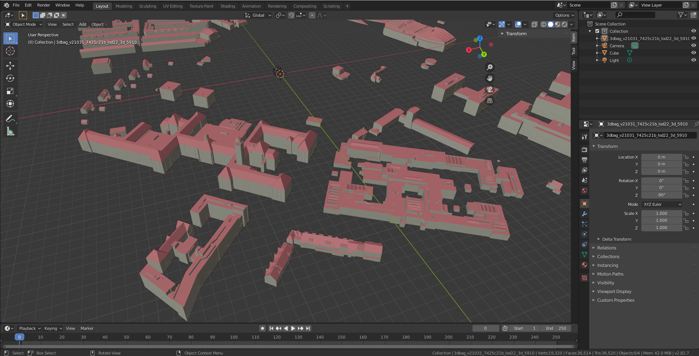
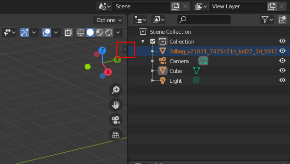

[Wavefront OBJ](http://paulbourke.net/dataformats/obj/) is een open bestandsformaat voor 3D graphics. Het bevat dus geen attributen van de 3DBAG gebouwen, maar uitsluitend de geometrieën. Het is voornamelijk beschikbaar voor het integreren van de 3DBAG data in 3D CAD software (waar mogelijk conversie van de data voor benodigd is) en software voor 3D-modellering (bijvoorbeeld [Blender](https://www.blender.org/)).

De OBJ-bestanden van de 3DBAG bevatten alleen de 3D geometrieën en [elke 3D laag](../schema/layers.md#data-layers) is opgeslagen in een apart bestand. Ze zijn gecomprimeerd in een ZIP-bestand per tegel. De object-coördinaten zijn in het [Amersfoort / RD New + NAP height](http://epsg.io/7415) geodetisch coördinatensysteem.

NB: Om geautomatiseerd meerdere 3DBAG-tiles in OBJ-formaat te downloaden, kun je [dit script](https://github.com/3DBAG/3dbag-scripts/blob/main/tile_download.py) gebruiken.

## Blender

<figure>
  
  <figcaption>Een 3DBAG tegel in OBJ-formaat geopend in Blender.</figcaption>
</figure>

OBJ kan makkelijk geïmporteerd worden in Blender. Overigens is er ook een [CityJSON plugin](https://github.com/cityjson/Up3date) beschikbaar.

Omdat de bestanden werkelijke (en dus grote) coördinaten bevatten en niet gecentreerd zijn rondom de origin (0, 0, 0) in Blender zie je in eerste instantie dat de objecten flikkeren. Het is daarom een goed idee om ze te verplaatsen naar het midden van de scene.

<figure>
  
</figure>

Kies bij het importeren van de data voor `Z Up` zodat het model juist georiënteerd wordt. Om het makkelijker te maken kan je ook `Split by Object` uitzetten, zodat alle gebouwen als één object geladen worden. Je kunt na het importeren de camera focussen op het model door het te selecteren in `Scene Collection` rechts op het scherm, en vervolgens op `.` op het numpad te drukken (de normale `.` op het toetsenbord werkt niet).

<figure>
  
</figure>

Selecteer vervolgens het object (of alle individuele objecten als je ze op die manier ingeladen hebt) en druk op Tab om de Edit Mode te openen. Klik op het pijltje dat gemarkeerd is in bovenstaande screenshot...

<figure>
  
</figure>

En verander X en Y naar 0. Druk wederom op `.` op het numpad om de camera weer te focussen op het model.
