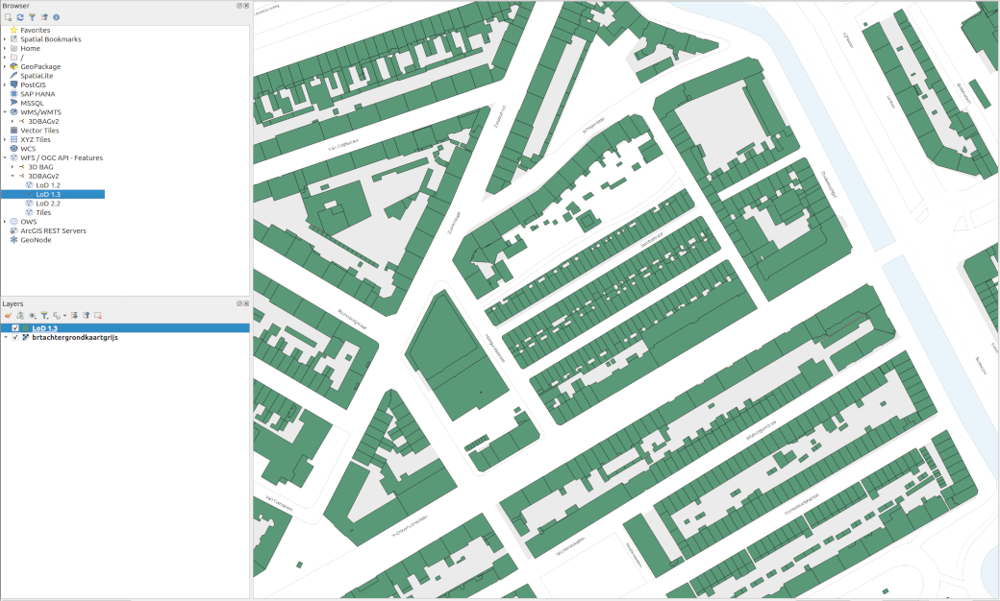
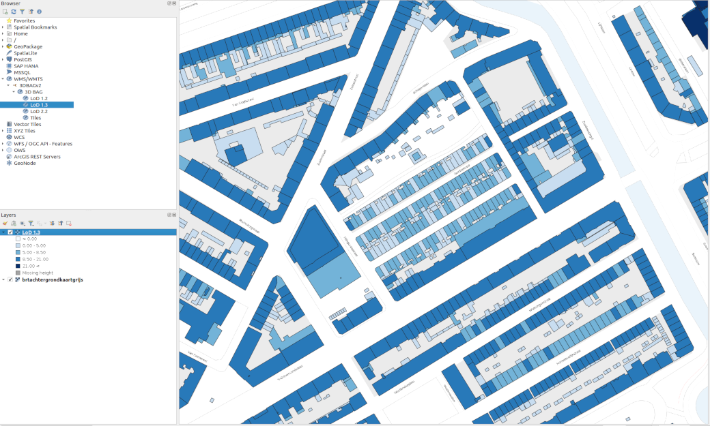

Webservices maken het mogelijk om via een URL exact te specificeren welke 3DBAG gebouwen je wilt downloaden. Wij bieden traditionele 2D webservices (WFS/WMS) en een experimentele 3D webservice aan.

De 2D webservices worden ondersteund door de meeste GIS software pakketten. Ze bevatten zowel de [2D lagen](../schema/layers.md#data-layers), als de tegel-index die we gebruiken voor het verspreiden van de data in de verschillende formaten. 

Daarnaast is er ook een experimentele 3DBAG API beschikbaar. Hiermee kunnen alle 3DBAG gebouwen met 3D geometrie en alle beschikbare attributen in het [CityJSONFeatures](https://www.cityjson.org/specs/2.0.0/#text-sequences-and-streaming-with-cityjsonfeature) formaat gedownload worden.

De links naar de webservices staan op de 3DBAG [Downloads](https://3dbag.nl/nl/download) pagina.

## WFS (2D)

[Web Feature Service (WFS)](https://www.ogc.org/standards/wfs) is een OGC-standaard die beschrijft hoe geografische vectordata opgevraagd, gecreëerd en bewerkt kan worden via internet.

Beschikbare lagen:

- lod12
- lod13
- lod22
- tiles

<figure>
  <a href="../../../images_common/wfs.png">
    
  </a>
  <figcaption>LoD1.3 2D laag van de WFS gevisualiseerd in QGIS, met de BRT Achtergrondkaart van PDOK op de achtergrond.</figcaption>
</figure>

## WMS (2D)

Ook [Web Map Service (WMS)](https://www.ogc.org/standards/wms) is een OGC-standaard, maar dan om kaarten als afbeelding op te vragen.

<figure>
  <a href="../../../images_common/wms.png">
    
  </a>
  <figcaption>LoD1.3 2D laag van de WMS gevisualiseerd in QGIS, met de BRT Achtergrondkaart van PDOK op de achtergrond.</figcaption>
</figure>

## 2D webservices in QGIS

[Hier](https://www.youtube.com/watch?v=dWTGOm3Emw4&list=PL4POqt8zsiXFJEEF88f6uAnfuOQSAoG6l) vind je een QGIS tutorial over webservices van een van onze 3D geoinformation groep collega's. Op 3:18 in de video laat hij specifiek zien hoe je de webservices van de vorige versie van de 3DBAG gebruikt. Het grootste verschil met de nieuwe 3DBAG is dat je nu kunt specificeren welke laag van de data je wilt gebruiken (de tegel-index of een van de LoDs).

In die video wordt eveneens de [PDOK services plugin](https://plugins.qgis.org/plugins/pdokservicesplugin/) geïntroduceerd, met handige webservices die kunnen fungeren als referentiekaart.

## Experimentele 3DBAG API

De 3DBAG API is beschikbaar via [api.3dbag.nl](https://api.3dbag.nl). Gedetailleerde informatie over de werking kan gevonden worden op de [ingebedde documentatie pagina](https://api.3dbag.nl/api.html). De 3DBAG API kan gebruikt worden om een enkel gebouw binnen te halen (op basis van de BAG `identificatie` code) of om alle gebouwen binnen een bounding box binnen te halen. De 3DBAG objecten worden teruggegeven in het [CityJSONFeatures](https://www.cityjson.org/specs/2.0.0/#text-sequences-and-streaming-with-cityjsonfeature) formaat.

Hieronder staat een korte python code die laat zijn hoe je een [`.city.jsonl` bestand](https://www.cityjson.org/specs/2.0.0/#text-sequences-and-streaming-with-cityjsonfeature) kan maken van een  verzoek aan de 3DBAG API:

```python
import urllib.request
import json

myurl = "https://api.3dbag.nl/collections/pand/items/NL.IMBAG.Pand.1655100000500568"
with urllib.request.urlopen(myurl) as response:

    j = json.loads(response.read().decode('utf-8'))
    with open("output.city.jsonl", "w") as my_file:
        my_file.write(json.dumps(j["metadata"]) + "\n")
        if "feature" in j:
            my_file.write(json.dumps(j["feature"]) + "\n")
        if "features" in j:
            for f in j["features"]:
                my_file.write(json.dumps(f) + "\n")
```

De 3DBAG API zit momenteel in een experimentele beta fase. Momenteel is deze nog niet OGC-compliant, maar het is wel ons doel om in een latere versie van de 3DBAG volledig compliant te zijn met de [OGC API Features specificatie](https://ogcapi.ogc.org/features/). Momenteel wordt alleen het CRS Amersfoort / RD New + NAP height (EPSG:7415) ondersteund.