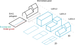
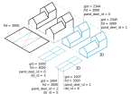

# Datalagen

{ width=100% }

De bovenstaande figuur laat het verband zien tussen een gebouw in het echt en hoe het is gemodelleerd en beschikbaar in de 3D BAG. De BAG modelleert gebouwen in 2D als de grootste omtrek, gezien vanaf boven. Dat komt neer op een enkele 2D polygon per gebouw, zoals de zwarte polygoon in de figuur. Om deze reden bevat het **BAG-polygoon** ook de delen van het gebouw die zich ondergronds bevinden.

Om een nauwkeurig model van de **bovengrondse** delen van een gebouw te maken, snijden we het **ondergrondse** deel van de BAG-polygoon eraf. We nemen alleen bovengrondse delen mee, aangezien we geen data hebben over de 3D omvang van ondergrondse delen.

Voor de bovengrondse delen genereren we vervolgens de 3D modellen in LoD1.2, 1.3 en 2.2. We weten dat het bij sommige toepassingen makkelijker is om 2D polygonen in te lezen, en de informatie over de gebouwhoogte als attributen. Daarom bieden we ook een 2D versie aan voor iedere LoD. Bovendien kan de gebruiker hierdoor kiezen uit de verschillende referentiehoogtes die we berekenen per gebouw.

!!! note "lod11_replace"
    In het geval van kassen en grote magazijnen snijden we geen delen van het BAG-pand, maar nemen we de polygoon zoals die is en genereren we slechts een LoD1.1 model. Dit soort gebouwen hebben dus alleen een LoD1.1 model en zijn gemarkeerd met de attribuutwaarde `lod11_replace = true`.

Bij de 2D modellen representeren de polygonen de 2D projectie van de dakvlakken van het 3D model. Voor LoD1.2 en LoD1.3 kan het 3D model volledig gereconstrueerd worden uit het 2D model, door de 2D polygonen te nemen en elk van deze op te trekken tot een van hun [`h_dak_*`](attributes.md#h_dak_50p) hoogtewaarden. Echter is dit niet het geval voor de LoD2.2 modellen, omdat deze schuine daken hebben die niet gerepresenteerd kunnen worden door een 2D polygoon en een enkele hoogtewaarde.

De 3D BAG heeft 6 geometrische representaties van een BAG-object (een *feature*). De 6 representaties zijn de 2D en 3D varianten van de LoD1.2, LoD1.3 en LoD2.2 modellen van de feature. Daarom hebben de BAG-modellen, die zijn opgeslagen in de `pand`-laag, een *feature ID* ([`fid`](attributes.md#fid)), terwijl hun geometrische representaties *geometry IDs* ([`gid`](attributes.md#gid)) hebben. Afhankelijk van de representatie kan een enkele feature meerdere geometrie-delen hebben.

Sommige gebouwen hebben meerdere niet-verbonden bovengrondse delen, terwijl ze aan elkaar verbonden zijn door bijvoorbeeld een ondergrondse garage. In deze gevallen worden de bovengrondse delen opgedeeld in afzonderlijke modellen met dezelfde `fid`, en de [`pand_deel_id`](attributes.md#pand_deel_id) kan deze verschillende delen identificeren binnen dezelfde feature.

De onderstaande figuur illustreert de relatie tussen de **feature** en de verschillende **bovengrondse** geometrie-delen.

{ width=100% }

<!-- start layers (DO NOT REMOVE THIS MARKER AND DO NOT EDIT THE TEXT BELOW. SEE README.) -->
## `pand`

Bevat de attributen en geometrie van het `Pand`-object van de BAG, plus de attributen van de 3D BAG die gelden voor het gehele gebouw. Omvat uitsluitend de gebouwen die daadwerkelijk door de reconstructie gegaan zijn. Het attribuut `fid` is het unieke, numerieke ID van de objecten. Naast dat het de primaire *key* is, wordt `fid` ook gebruikt voor het samenvoegen van andere lagen met `pand`.

## `lod12_3d`

Een 3D model van de bovengrondse gebouwdelen, gemodelleerd in LoD1.2. Kan samengevoegd worden met `pand` op `fid`.

## `lod12_2d`

De 2D projectie van het LoD1.2 model. De hoogte van de gedetecteerde LoD1.2 dakoppervlakken zijn opgeslagen als hoogteattributen ([`h_dak_*`](attributes.md#h_dak_50p)). Alleen de bovengrondse delen van de BAG-polygoon zijn meegenomen. Kan samengevoegd worden met `pand` op `fid`.

## `lod13_3d`

Een 3D model van de bovengrondse gebouwdelen, gemodelleerd in LoD1.3. Kan samengevoegd worden met `pand` op `fid`.

## `lod13_2d`

De 2D projectie van het LoD1.3 model. De hoogte van de gedetecteerde LoD1.3 dakoppervlakken zijn opgeslagen als hoogteattributen ([`h_dak_*`](attributes.md#h_dak_50p)). Alleen de bovengrondse delen van de BAG-polygoon zijn meegenomen. Kan samengevoegd worden met `pand` op `fid`.

## `lod22_3d`

Een 3D model van de bovengrondse gebouwdelen, gemodelleerd in LoD2.2. Kan samengevoegd worden met `pand` op `fid`.

## `lod22_2d`

De 2D projectie van het LoD2.2 model. De hoogte van de gedetecteerde LoD2.2 dakoppervlakken zijn opgeslagen als hoogteattributen ([`h_dak_*`](attributes.md#h_dak_50p)). Alleen de bovengrondse delen van de BAG-polygoon zijn meegenomen. Kan samengevoegd worden met `pand` op `fid`.

<!-- end layers (DO NOT REMOVE THIS MARKER) -->
